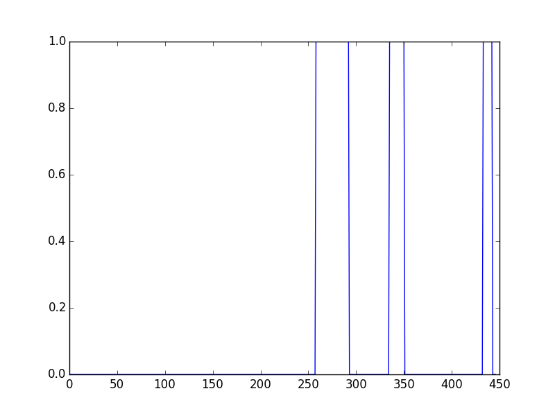

% Project Lambda
% Jordeen Chang, Alon Daks, Ying Luo, Lisa Ann Yu
% December 3, 2015

## The Paper
- A high-resolution 7-Tesla fMRI dataset from complex natural stimulation with an audio movie

## Abstract

- Brief Overview of Original Study:
    - 20 participants recorded at a high field strength of 7 Tesla while listening to *Forrest Gump*
    - Collected fMRI data for entire movie in .niigz format with additional information regarding movie scenes
    - Used MRI scanner and pulse oximetry to conduct blood oxygen level dependent (BOLD) imaging, structural MRI imaging, and physiological assay
    - Its goal is to provide data for others to explore auditory cognition, language and music perception, social perception, etc.
- Our Goal:                                                                     
    - Reproduce a subject of analysis conducted by Hanke et. al                 
    - Apply machine learning to see if we can predict if a subject was listening to a day or night movie scene based on brain state

# Data Extraction & Exploration

##Extraction                                                                    
- First had to overcome the large amount of data to sift through                
    - Testing only on Subject 1 for sake of time and efficiency: limited project scope from 320 GB to 5 GB
    - Chose to only use nonlinear alignment out of raw data, linear alignment, and nonlinear
- Smoothed data by applying Gaussian filter                                     
- Designed a clean schema by introducing a data_path.json file to reference where each raw data file is located

##

# Methods & Results

##Process Overview: Reproducing                                                 
- Two methods for correlation mentioned in paper, and chose to reproduce the first: taking BOLD time-series and calculating voxel-wise pearson correlation on the raw data that Matthew provided.
- Using multiple EC2 instances to run analysis, so that we can load both two hour time courses in a pair and parallelize the process since correlation takes 10 minutes on our laptops.
- Defined a UNIX environment variable STAT159_CACHED_DATA that allows users to choose if they want data to be recomputed.
- Results are still being processed.

##Analysis Overview: Predicting                                                 
- Parsed through “scenes.csv” and “demographics.csv” for information about movie scenes and subjects
- Conducted t-test to determine if brain signal is significantly different between day and night scenes for each voxel
- Retrieved top 32 voxels with biggest change between the groups.  

##
Step 1: Determine which slices are on and which are off      

##
Step 2: Create a Design Matrix                                            

  

##
Step 3: Calculate the betas for each voxel

##

##

##
Step 4: Test the hypothesis that beta = 0 to generate t-statistics

##

## Analysis Overview: Predicting (cont.)                                         
- Using random forest with 1000 in the voxels as the features                   
- 80% training, 20% testing                                                     
- 83% accuracy, but the data is 86% day, so not doing too well.                 
- Next steps include cross validation on feature set and running prediction on other parts of the data like sentiment and interior/exterior

## Future Work                                                                  
- Considered exploring possible physiological responses to certain movie scenes by gender and age, but not enough computing resources and data to do so
- Predict familiarity with *Forrest Gump*
    - Difference in voxel activation between participants with high and low  amounts of prior exposure
    - Machine learning
    - However, there are a relatively small number of participants, since fMRI is expensive, so the predictive ability of that study would be rather limited
